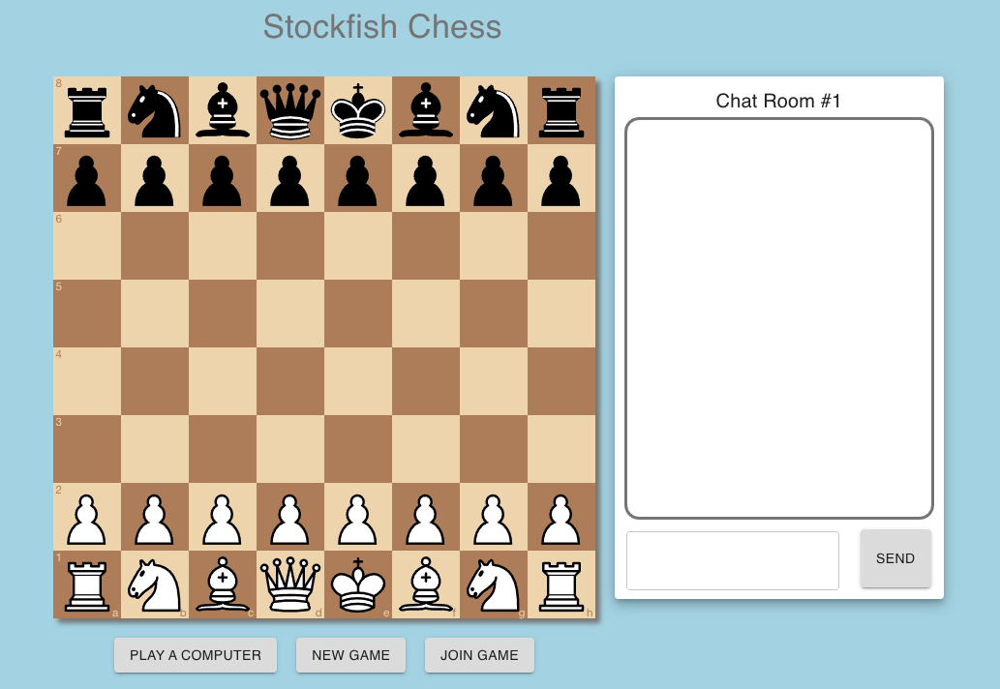

# Stockfish Chess [](https://github.com/Buuntu/stockfish-chess/actions/workflows/main.yml)

A chess game using FastAPI and React to play against the Stockfish engine.



## Features

- **FastAPI** with Python 3.8
- **React 16** with Typescript
- Postgresql
- SqlAlchemy with Alembic for migrations
- Pytest for backend tests
- Jest for frontend tests
- Prettier/Black for linting
- Docker compose for easier development
- Nginx as a reverse proxy to allow backend and frontend on the same port

## Development

The only dependencies for this project should be docker and docker-compose.

### Quick Start

Starting the project with hot-reloading enabled
(the first time it will take a while):

```bash
docker-compose up -d
```

To run the alembic migrations (for the users table):

```bash
docker-compose run --rm backend alembic upgrade head
```

And navigate to http://localhost:8000

_Note: If you see an Nginx error at first with a `502: Bad Gateway` page, you may have to wait for webpack to build the development server (the nginx container builds much more quickly)._

Auto-generated docs will be at
http://localhost:8000/api/docs

### Rebuilding containers:

```
docker-compose build
```

### Restarting containers:

```
docker-compose restart
```

### Bringing containers down:

```
docker-compose down
```

### Frontend Development

Alternatively to running inside docker, it can sometimes be easier
to use npm directly for quicker reloading. To run using npm:

```
cd frontend
npm install
npm start
```

This should redirect you to http://localhost:3000

### Frontend Tests

```
cd frontend
npm install
npm test
```

## Migrations

Migrations are run using alembic. To run all migrations:

```
docker-compose run --rm backend alembic upgrade head
```

To create a new migration:

```
alembic revision -m "create users table"
```

And fill in `upgrade` and `downgrade` methods. For more information see
[Alembic's official documentation](https://alembic.sqlalchemy.org/en/latest/tutorial.html#create-a-migration-script).

## Testing

There is a helper script for both frontend and backend tests:

```
./scripts/test.sh
```

### Backend Tests

```
docker-compose run backend pytest
```

any arguments to pytest can also be passed after this command

### Frontend Tests

```
docker-compose run frontend test
```

This is the same as running npm test from within the frontend directory

## Logging

```
docker-compose logs
```

Or for a specific service:

```
docker-compose logs -f name_of_service # frontend|backend|db
```

## Project Layout

```
backend
└── app
    ├── alembic
    │   └── versions # where migrations are located
    ├── api
    │   └── api_v1
    │       └── endpoints
    ├── core    # config
    ├── db      # db models
    ├── tests   # pytest
    └── main.py # entrypoint to backend

frontend
└── public
└── src
    ├── components
    │   └── Home.tsx
    ├── config
    │   └── index.tsx   # constants
    ├── __tests__
    │   └── test_home.tsx
    ├── index.tsx   # entrypoint
    └── App.tsx     # handles routing
```
